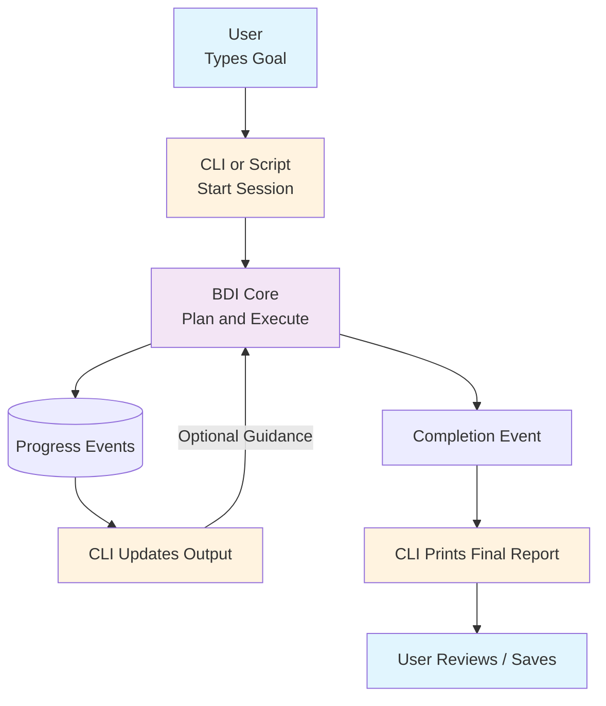

# High-Level Usage Flow (User • CLI • Agent)

This slide-friendly overview shows how a person uses the BDI framework from the CLI or a Python script. No code knowledge required.

---
## 1. User Starts the Agent
The user launches the CLI or runs a script with a goal like: "Summarize repo changes and draft a release note."

Action: Runs a command or script entry point (for example, `start`).

---
## 2. Runner Initializes the BDI Core
The CLI or script:
1. Validates the input goal.
2. Creates an agent session and loads configuration.
3. Converts the goal into a new desire for the BDI core.

At this point, the BDI core begins internal planning (details abstracted for users).

---
## 3. BDI Core Generates and Runs a Plan
Inside the core (not visible to the user):
- The goal is turned into a plan with steps.
- Steps start executing one by one (research, analyze, draft, refine, etc.).
- Progress events are emitted (status changes, partial outputs, errors, completion notes).

---
## 4. Progress Updates in the CLI
The CLI displays lightweight updates:
- Current status (Working / Waiting / Needs Input).
- Latest message and intermediate results.
- Optional logs for deeper inspection.

---
## 5. Optional User Intervention (Guidance)
If the agent encounters a difficulty (or the user just wants a change), the CLI prompts for guidance.

User can type guidance like: "Skip docs/" or "Add a changelog section."

The BDI core updates its internal plan and resumes.

---
## 6. Completion and Output
When the plan finishes:
- The BDI core emits a completion event with final output (summary text, structured data, etc.).
- The CLI prints the final report and can optionally save it to disk.

---
## 7. (Optional) Session History
Run logs can be stored for later review, making it easy to inspect past goals and outputs.

---
## 8. Key Value for Users
- Natural language in -> actionable structured work out.
- Real-time progress visibility builds trust.
- Optional guidance gives a feeling of collaboration.
- Final deliverable is clean and shareable.

---
## Mermaid Diagram (Slide Friendly)

---
## Simplified Sequence (Narrative)
1. User enters a goal and runs the CLI or script.
2. The runner registers the session and passes the goal to the BDI core.
3. BDI core plans and executes internally.
4. CLI streams progress updates.
5. (If needed) User provides guidance -> loop back to BDI.
6. BDI finishes -> final result returned.
7. User reviews, saves, or starts another.
