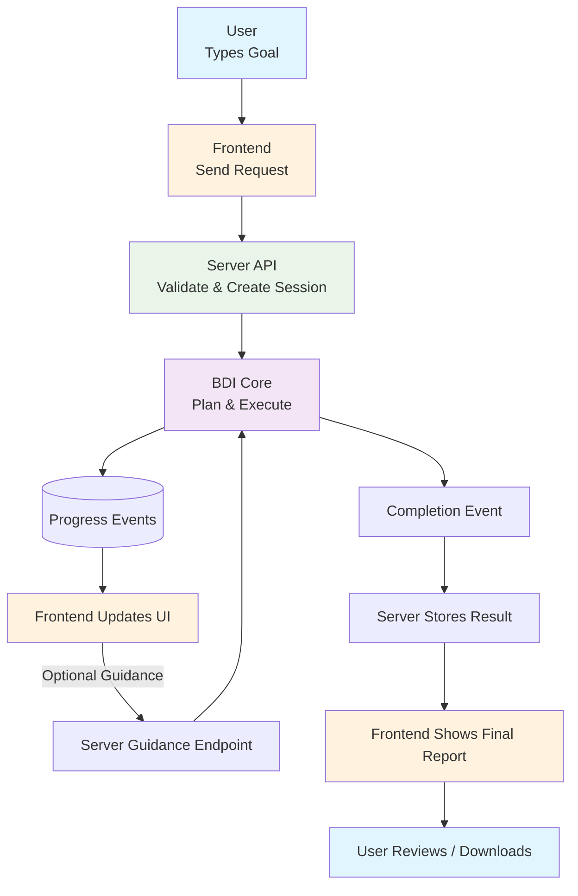

# High‑Level Usage Flow (User • App • Agent)

This slide‑friendly overview shows how a person uses the application: what happens in the browser (frontend), what the server does, and how the underlying BDI logic works behind the scenes. No code knowledge required.

---
## 1. User Opens the App (Frontend)
The user lands on the web interface and sees a simple input area: “Describe what you want the AI assistant to do.”

They type a natural sentence or short list (e.g. “Summarize repo changes and draft a release note”).

Action: Clicks a button like "Start Agent".

---
## 2. Frontend Sends a Request to Server
The browser packages the user’s text (plus optional simple settings like priority or allow-human-help) into a JSON request.

Example (conceptual):
{
   "goal": "Summarize repo changes and draft a release note",
   "options": { "hitl": true }
}

The request goes to an API endpoint on the server (e.g. /api/agents or /api/desires).

---
## 3. Server Validates & Hands Off to BDI Core
The server:
1. Checks the payload is well‑formed (basic validation).
2. Creates / updates an “agent session” record.
3. Forwards the clean goal text to the BDI layer (agent manager) as a new desire.

At this point, the BDI core begins internal planning (details abstracted for users).

---
## 4. BDI Core Generates & Runs a Plan
Inside the core (not visible to the user):
- The goal is turned into a plan with steps.
- Steps start executing one by one (research, analyze, draft, refine, etc.).
- Progress events are emitted (status changes, partial outputs, errors, completion notes).

---
## 5. Server Streams Progress Back
The server listens to events from the BDI core and relays simplified updates to the frontend via:
- Streaming responses (Server‑Sent Events) OR
- WebSocket / periodic polling (implementation dependent).

Each update is lightweight: current status (Working / Waiting / Needs Input), latest message, percent done (if estimable), and any intermediate result text.

---
## 6. Frontend Updates the UI
The browser renders a live progress panel:
- Current task title
- Step summary (“Analyzing files…”) 
- Intermediate draft or bullet points
- A button or form for user guidance if the agent asks for help

Color / icon cues show states: Running, Paused (needs input), Completed.

---
## 7. Optional User Intervention (Guidance)
If the agent encounters a difficulty (or the user just wants a change), the UI offers a prompt: “Adjust direction?”

User can type guidance like: “Skip file docs/, focus only on src/” or “Add a changelog section.”

Frontend sends a guidance request to a server endpoint (e.g. /api/agents/{id}/guide).

Server relays this to the BDI core, which updates its internal plan and resumes.

---
## 8. Completion & Delivery
When the plan finishes:
- BDI core emits a completion event with final output (summary text, structured data, etc.).
- Server stores final result and returns a completion message.
- Frontend displays a clean final report and offers “Download / Copy / Start New”.

---
## 9. (Optional) Session History
The user can open a “Past Runs” / “History” view showing previous goals and generated outputs. Selecting one reopens its summary (no need to replay all internal steps for the user).

---
## 10. Key Value for Users
- Natural language in → Actionable structured work out.
- Real‑time progress visibility builds trust.
- Optional guidance gives a feeling of collaboration.
- Final deliverable is clean and shareable.

---
## Mermaid Diagram (Slide Friendly)

---
## Simplified Sequence (Narrative)
1. User enters a goal and submits.
2. Frontend sends it to server.
3. Server registers session and passes goal to BDI core.
4. BDI core plans & executes internally.
5. Server streams progress events.
6. Frontend live‑updates display.
7. (If needed) User provides guidance → loop back to BDI.
8. BDI finishes → final result returned.
9. User reviews, saves, or starts another.

